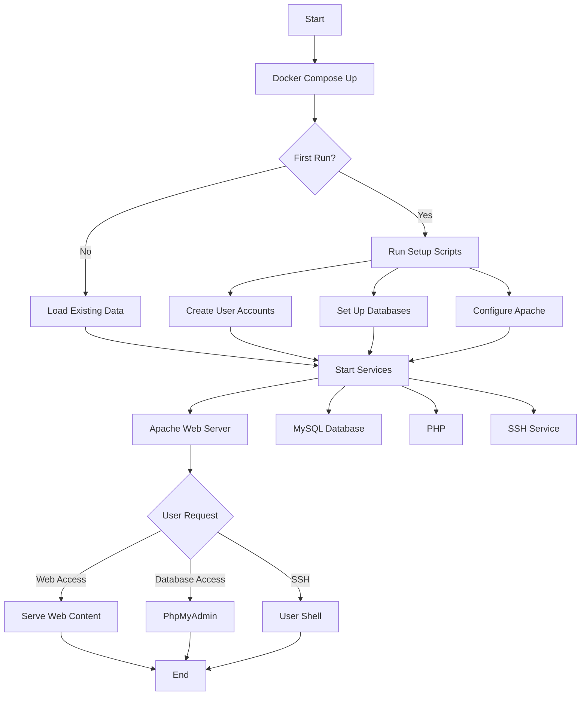
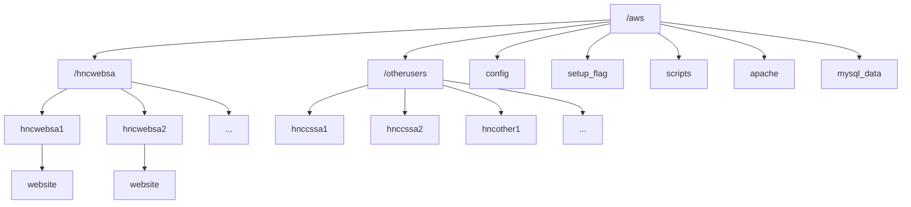

<h1 align="center">🐳 LAMP Stack Docker Project 🐳</h1>

<div align="center">
  
</div>


This project sets up a LAMP (Linux, Apache, MySQL, PHP) stack using Docker, with additional features for user management and web hosting. It's designed to create a development environment for multiple user groups with different access levels.

## 🌟 Features

- 🐧 Linux + 🚀 Apache + 🐬 MySQL + 🐘 PHP containerized with Docker
- 👥 Multiple user groups with different access levels:
  - `hncwebsa`: Web development users with their own web directories
  - `hnccssa`: Computer Science users 
  - `hncothers`: Other users
- 💾 Persistent user data and MySQL databases
- 🔐 SSH access for Computer Science and Other users
- ⚓ FTP access for Web development users
- 🛠 PhpMyAdmin for database management for all


## 🏗 Architecture

### Permissions

| Class Name | Group name  | Naming Convention | MySQL | phpMyAdmin | FTP access | SSH access |
| ---------- | ----------- | ----------------- | :---: | :--------: | :--------: | :--------: |
| WebDev     | hncwebsa | hncwebsa1       |   X   |     X      |     X      |            |
| MySQL      | hnccssa | hnccssa1       |   X   |     X      |            |     X      |
| AWS        | hncother | hncother1       |   X   |     X      |           |     X      |

### 🛠 Prerequisites

- Docker 🐳
- Docker Compose 🐙

## 🚀 Setup

1. Clone this repository:
   ```bash
   git clone https://github.com/kennyHH/AWS.git
   cd AWS
   ```

2. Copy or modify your `hnccssa.csv`, `hncwebsa.csv`, and `hncothers.csv` files to the project root.

3. Create a `.env` file in the project root and add:
   ```
   MYSQL_ROOT_PASSWORD=your_secure_password_here
   ```

4. Build and start the containers:
   ```bash
   docker-compose up -d --build
   ```
>[!TIP] 
> To recreate the environment from scratch clear/empty folders `apache,mysql_data,student_code,setup_flag and othershome` or use script `cleanup.sh`.


## 🖥 Usage

- Apache web server is accessible at `http://<ip>`
- PhpMyAdmin is accessible at `http://<ip>:8080`
- Student websites are accessible at `http://<ip>/student1` etc.
- SSH into the Apache container:
  ```bash
  ssh -p 2222 <username>@<ip>
  ```
- To connect to MySQL after logging using SSH:
  ```bash
  mysql -h mysql -P 3306 -u<username> -p
  ```


>[!IMPORTANT] 
> - Each Web Development users have restricted FTP access for their web-accessible content.
> - Only MySQL databases and users home folders have persistance.

**Setup folders**
- `/config/`: Stores configuration files for the project
- `/scripts/`: Holds script files for setup and maintenance
- `/setup_flag/`: Contains flags to indicate setup status
  
**Persistent folders**
- `/hncwebsa/`: Contains home directories for web development users (hncwebsa1, hncwebsa2, etc.)
- `/otherusers/`: Houses home directories for restricted users (hnccssa and hncothers groups)
- `/mysql_data/`: Stores MySQL database files for persistence
- `/apache/`: Contains Apache configuration files

## 👤 User Management

Users are created based on the CSV files:
- `hncwebsa.csv`: Web development users
- `hnccssa.csv`: Computer Science access users
- `hncothers.csv`: Other restricted access users

Format for CSV files:
```csv
username,password
```

## 💾 Persistence

User data including home folders and MySQL databases persist across container restarts.


## 🔒 Security Notes

- 🔑 Change default passwords in CSV files for production use
- 🛡️ Review and adjust file permissions as needed
- 🔐 Consider using Docker secrets for sensitive information in production

## 📊 Diagrams and Visualizations

### 🌊 Flowchart



### 📁 Directory Structure



## 🔧 Bugs

#### Apache errors

- `AH00671: The Alias directive in /etc/apache2/sites-enabled/student19.conf at line 1 will probably never match because it overlaps an earlier Alias.`
- `[Note] Access denied for user 'root'@'localhost' (using password: NO)`


## 🖥 Roadmap 


## 🤝 Contributing

Please read [CONTRIBUTING.md](CONTRIBUTING.md) for details on our code of conduct, and the process for submitting pull requests.

## 📄 License

This project is licensed under the MIT License - see the [LICENSE.md](LICENSE.md) file for details.

---

<div align="center">
  Made with ❤️ by Bartosz Mazur
</div>
