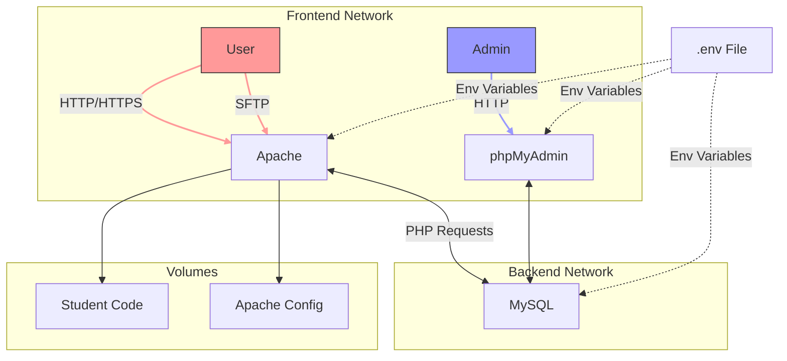
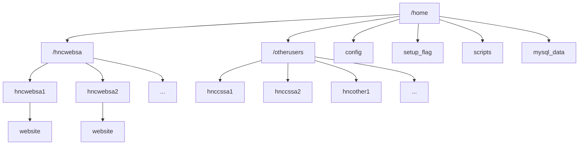

# 🐳 LAMP Stack Docker Project

<div align="center">
  
</div>

This project sets up a LAMP (Linux, Apache, MySQL, PHP) stack using Docker, with additional features for user management and web hosting. It's designed to create a development environment for multiple user groups with different access levels.

## 🌟 Features

- 🐧 Linux + 🚀 Apache + 🐬 MySQL + 🐘 PHP containerized with Docker
- 👥 Multiple user groups with different access levels:
  - `hncwebsa`: Web development users with their own web directories
  - `hnccssa`: Users with restricted access
  - `hncothers`: Other users with restricted access
- 💾 Persistent user data and MySQL databases
- 🛠 PhpMyAdmin for database management
- 🔐 SSH access for users

## 🏗 Architecture



## 🛠 Prerequisites

- Docker 🐳
- Docker Compose 🐙

## 🚀 Setup

1. Clone this repository:
   ```bash
   git clone https://github.com/kennyHH/AWS.git
   cd AWS
   ```

2. Copy or modify your `hnccssa.csv`, `hncwebsa.csv`, and `hncothers.csv` files to the project root.

3. Create a `.env` file in the project root and add:
   ```
   MYSQL_ROOT_PASSWORD=your_secure_password_here
   ```

4. Build and start the containers:
   ```bash
   docker-compose up -d --build
   ```

## 🖥 Usage

- Apache web server is accessible at `http://<ip>`
- PhpMyAdmin is accessible at `http://<ip>:8080`
- SSH into the Apache container:
  ```bash
  ssh -p 2222 username@<ip>
  ```

## 📁 Directory Structure



## 🌊 Flowchart

```mermaid
graph TD
    A[Start] --> B[Docker Compose Up]
    B --> C{First Run?}
    C -->|Yes| D[Run Setup Scripts]
    C -->|No| E[Load Existing Data]
    D --> F[Create User Accounts]
    D --> G[Set Up Databases]
    D --> H[Configure Apache]
    E --> I[Start Services]
    F --> I
    G --> I
    H --> I
    I --> J[Apache Web Server]
    I --> K[MySQL Database]
    I --> L[PHP]
    I --> M[SSH Service]
    J --> N{User Request}
    N -->|Web Access| O[Serve Web Content]
    N -->|Database Access| P[PhpMyAdmin]
    N -->|SSH| Q[User Shell]
    O --> R[End]
    P --> R
    Q --> R
```



## 👤 User Management

Users are created based on the CSV files:
- `hncwebsa.csv`: Web development users
- `hnccssa.csv`: Computer Science access users
- `hncothers.csv`: Other restricted access users

Format for CSV files:
```csv
username,password
```

## 💾 Persistence

User data and MySQL databases persist across container restarts.


## 🔒 Security Notes

- 🔑 Change default passwords in CSV files for production use
- 🛡️ Review and adjust file permissions as needed
- 🔐 Consider using Docker secrets for sensitive information in production

## 🔧 Troubleshooting

WIP

## 🖥 Roadmap 
- Persitence for users

## 🤝 Contributing

Please read [CONTRIBUTING.md](CONTRIBUTING.md) for details on our code of conduct, and the process for submitting pull requests.

## 📄 License

This project is licensed under the MIT License - see the [LICENSE.md](LICENSE.md) file for details.

---

<div align="center">
  Made with ❤️ by Bartosz Mazur
</div>
